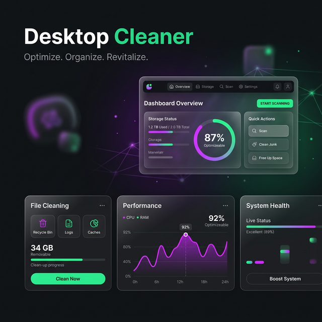

<div align="center">
  
  
  # ⚡ Desktop Cleaner
  
  > **Ваш ультимативный помощник для чистоты и производительности Windows-систем.**

  [Особенности](#-особенности) • [Установка и запуск](#-установка-и-запуск) • [Стек](#-технологии) • [Скриншоты и дизайн](#-премиум-дизайн)
  
  
  
  
</div>

<br>

**Desktop Cleaner** — это элегантное и мощное портативное приложение, разработанное для быстрого освобождения оперативной памяти, очистки диска и автоматической логической сортировки файлов на рабочем столе. 

Программа отличается **современным UI/UX-дизайном**, вдохновленным macOS и концепцией интерфейсов glassmorphism, обеспечивая максимальное удобство без ущерба для функциональности. Идеально для людей, которые ценят чистоту своего рабочего пространства и высокую скорость работы ПК.

---

## ⚡ Особенности

* **⚙️ Мониторинг и управление процессами**: Отслеживайте потребление CPU и RAM с возможностью остановить зависшие процессы в один клик. Встроенная защита системных процессов `Windows`.
* **🛡️ Мгновенная очистка фоновых задач**: Высвобождайте гигабайты ОЗУ одной кнопкой. Умный алгоритм оставляет важные программы (Explorer, Chrome и др.) нетронутыми.
* **🗂️ Поиск дубликатов**: Ищите и безопасно удаляйте дубликаты файлов с идентичным хэшем, не переживая за оригиналы.
* **🖥️ Умный рабочий стол**: Автоматический перенос ярлыков и лишних файлов по логичным категориям, превращая хаос на экране в идеальный порядок.
* **🧹 Мощная очистка системы**: PowerShell-скрипты, очищающие кэш браузеров, временные системные файлы `TEMP`, базу миниатюр и корзину за пару секунд.

---

## 🎨 Премиум Дизайн

Интерфейс спроектирован с упором на современные стандарты:
- **Sidebar Navigation:** Удобное меню слева для переключения разделов.
- **Dark Mode:** Премиальная тёмно-синяя и угольная палитра с индиго-акцентами (`#6366f1`).
- **Сглаженные формы:** Детализированные контейнеры (Cards) с тенями и скруглениями для приятного визуального восприятия.

---

## 🚀 Установка и запуск

Приложение **полностью портативно**, не требует установки в систему или прав администратора для основного функционала — просто скопируйте папку.

1. Убедитесь, что у вас установлен `Python 3.10` (или выше).
2. Загрузите файлы репозитория в любую удобную папку.
3. Установите зависимости:
   ```bash
   pip install -r requirements.txt
   ```
4. Запустите программу файлом `Desktop Cleaner.bat` или тихим скриптом `Запуск без консоли.vbs`.

> **💡 Лайфхак**: Можно запустить напрямую через интерпретатор:
> `python desktop_app.py`

---

## 🛠 Технологии

- [**Python 3**](https://www.python.org/) — основной язык.
- [**CustomTkinter**](https://github.com/TomSchimansky/CustomTkinter) — реализация великолепного UI/UX.
- **psutil** — глубокая интеграция для работы с системными процессами, RAM и CPU.
- **PowerShell** — под капотом для глубокой очистки Windows-директорий.

---

<div align="center">
  <p>Создано для портфолио с ❤️ и заботой о перфекционистах!</p>
</div>
